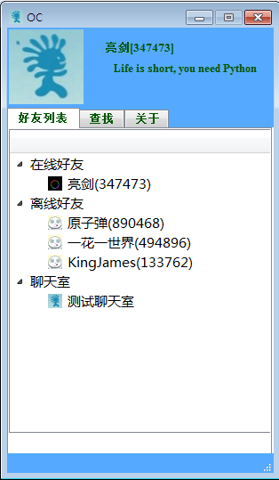
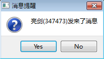
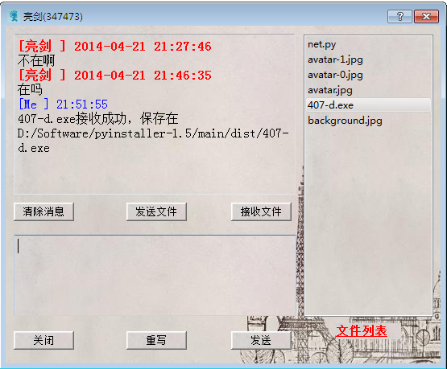
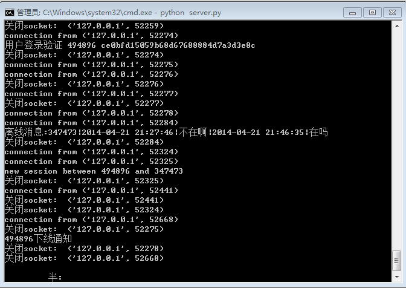

# pychat

## Introduction
pychat is a C/S structure chat tool with friendly UI.It supports

- registration
- login
- add friend
- multi-session
- online/offline message
- online/offline file transmission
- online/offline remind

## Todo
- daemonize server
- create pyqt4 install script

## Dev

- Python2.7
- PyQt4 [install](https://riverbankcomputing.com/software/pyqt/download)

## Deplyment

The server's default IP is 127.0.0.1.

## Screenshots

`friend lists`  

`chat dialog`  

`offline message remind`   

`recv offline file`  

`server log`  

