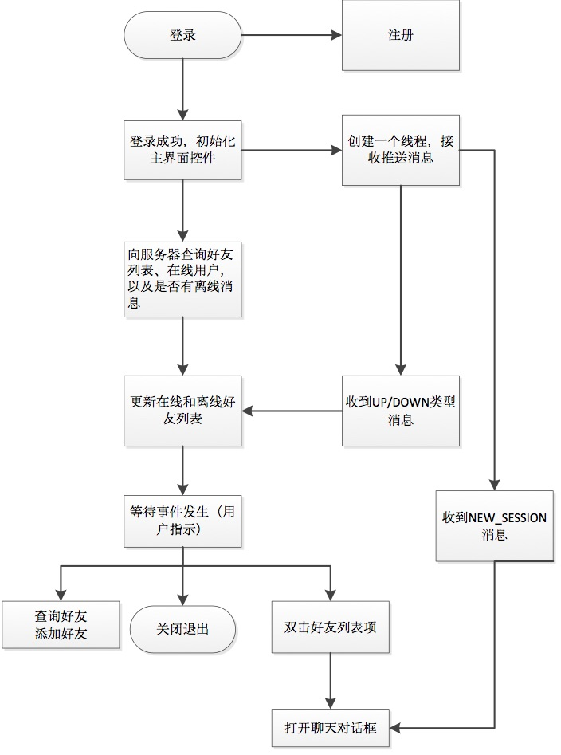

## 基本功能
1. 支持多人聊天；
2. 支持离线消息；
3. 拥有仿QQ的主界面和聊天窗口；
4. 支持文件上传、下载、离线上传下载、历史文件下载；
5. 支持用户注册、验证登录、添加好友；
6. 支持好友上线、下线通知（动态的在好友列表中的“在线好友”和“离线好友”栏中切换）；

## 服务器设计

### 用户管理模块

为实现一个网络聊天工具的基本业务逻辑，在基本要求和扩展要求的基础上，添加用户注册和登录验证功能。服务器需要保存用户注册信息，一般会采用数据库，本实验为确保程序运行环境的灵活性（方便助教测试，事实上使用数据库开发更方便），将用户注册信息保存在文件`server/user/user.pk`中。密码在传输过程中和在服务器保存的形式均为MD5密文，提高了安全性。`user.pk`文件的内容其实一个字典，如下所示：

    users={user_id_1: [email, nickname, password_md5], user_id_2: [email, nickname, password_md5]….}

`user_id_n`就是在注册时随机生成的一个6位的整数作为唯一标识OC号（类似QQ号，本实验中用于标识唯一用户的数字串），此处没有添加多余的字段，只有用户邮箱、昵称和密码。
另外一个重要的文件`server/user/friends.pk`用于保存好友关系，用于字典和列表实现，格式如下：

    friends={user_id_0: [user_id_0,user_id_1, user_id_2,…], user_id_1: [user_id_0,user_id_1, user_id_3,…]…}

列表`friends[user_id_n]`保存的是用户`user_id_n`的所有好友的OC号。
至于在线用户，服务器会在内存中存储一个onlineUser列表，保存在线用户的OC号。

### 聊天消息存储模块

服务器在转发聊天消息的同时将聊天记录保存到磁盘上，由于实验中数据比较少，也不采用数据库存储，并且所有的聊天记录保存在一个文件`server/msg/history.pk`中，每一条聊天记录的格式如下所示：

    send_user_id \t recv_user_id \t cur_time \ t msg_content \n

如果接收方不在线，那么将消息保存到离线消息文件server\msg\offline.pk中，格式如下：

    send_user_id \t recv_user_id \t cur_time \ t msg_content \n

待接收方上线后，将离线消息发送给他，并且将该离线消息从`offline.pk`文件移动到`history.pk`文件中。

### 文件存储模块

所有的上传文件保存的`server/file/`文件夹中，在该文件夹下有一个目录文件`file_info.txt`，用于保存所有的文件信息，格式如下：

    send_user_id \t recv_user_id \t upload_time \ t file_name\n

在上传成功后，如果接收方在线，服务器向接收方发送提示消息，接收方随时可以下载，如果接收主不在线，等接收方上线后会进行提醒。此外，在两个好友A和B会话期间，对话框右侧的文件列表中会显示所有可下载的文件（准确的说是两人进行传送过的所有历史文件），可以随时下载。

### 服务器消息转发

为实现消息的快速转发，服务器动态维护一个字典sessions，建立会话和关闭会话时，会动态增删。格式如下：

    sessions={user_id_1: {user_id_2: socket,.. }, user_id_2: {user_id_1: socket,.. }…}

`sessions[user_id_x][user_id_y]`表示`user_id_x`和服务器建立的一个socket会话，而这个会话的消息是发送给用户`user_id_y`的，服务器从`sessions[user_id_x][user_id_y]`获取消息时，转发给`sessions[user_id_y][user_id_x]`(如果存在的话)。

### 服务器向客户端推送消息

服务器大多是在响应客户端的请求，实验中所有的socket都是由客户端发起连接，但是有时候服务器也需要向客户端主动发送消息，所以服务器需要为每个客户端保存一个socket，用于推送消息（包括新消息提醒、离线，以及上线/下线提醒）。为实现该功能，服务器实时维护一个socket列表cmd_sock，保存在线用户的接收信息的socket.

### 请求报文的格式
这是服务器设计中最重要一环，为实现客户端和服务器的通信，双方必须约定一个格式（也就是协议），为了实现简单，容易理解，使用python中的`struct.pack`和`struct.unpack`，每个报文TCP传输的数据（也就是应用层部分）包括四个字段：

| FIELD-1 | FIELD-2 | FIELD-3 | FIELD-4 |
| ------- | ------- | ------- | ------- |

FIELD-1标识报文类型，FIELD-2~4根据FIELD-1有不同的含义。

| FIELD-1 | FIELD-2 | FIELD-3 | FIELD-4 |   含义  |
| :------ | :------ | :------ | :------ | :------ |
| SIGN_IN        | email       | nickname   | pwd_md5      | 注册新用户 |
| LOGIN          | user_id     | pwd_md5    |              | 登录|
| DOWN           | user_id     |            |              | 下线通知|
| CMD_SOCKET     | user_id     |            |              | 标识此socket用于接收推送消息|
| GET_FRIENDS    | user_id     |            |              | 获取自己的好友列表|
| GET_ONLINE     | user_id     |            |              | 获取目前在线的用户|
| FIND_FRIEND    | user_id     |            |              | 根据uid查询一个用户的信息|
| ADD_FRIEND     | user_id     | friend_id  |              | 添加好友|
| OFFLINE_MSG    | user_id     |            |              | 查询有没有自己的离线消息|
| NEW_SESSION    | user_id     | friend_id  |              | 建立会话请求|
| MESG           | user_id     | friend_id  | msg          | 发送消息|
| UPLOAD         | user_id     | friend_id  | file_name    | 上传文件请求|
| UPLOAD         | data_length | file_name  | file_content | 上传文件内容|
| UPLOAD_FINISH  | user_id     | friend_id  | file_name    | 上传结束|
| DOWN_FILE_NAME | user_id     | friend_id  |              | 获取可下载的文件列表|
| DOWNLOAD       | file_name   | recv_state | recvd_bytes  | 下载文件|

### 服务器的I/O模型
采用select模型实现I/O多路复用，使用队列Queue实现消息发送，具体参见`server/server.py`，主体框架代码并不多。

## 客户端框架
上一节已经详细介绍了请求的各种类型，客户端如果想得到某些信息，只需要按相应的数据报文类型格式进行请求，并解析服务器响应即可。这时客户端只剩下界面设计部分。

### 界面设计
使用QT Designer设计了四个界面`login.ui, register.ui, main.ui, chat.ui`,使用`pyuic4`命令生成对应的py文件，稍微修改。
`client/main.py`是主要的界面和逻辑实现部分，`client/net.py`是`main.py`用到的一些辅助的函数。

### 程序的主要流程

### 聊天对话框
启动聊天对话框后，首先从服务器获取可下载的文件列表，如果有离线消息的话，也是从主程序传过来的，在此不用查询。

### 文件上传与下载
服务器设计的相应报文格式：

| | | | | | |
| ---- | ---- | ---- | ---- | ---- | ---- |
| 1 | UPLOAD         | user_id     | friend_id  | file_name    | 上传文件请求|
| 2 | UPLOAD         | data_length | file_name  | file_content | 上传文件内容|
| 3 | UPLOAD_FINISH  | user_id     | friend_id  | file_name    | 上传结束|
| 4 | DOWN_FILE_NAME | user_id     | friend_id  |              | 获取可下载的文件列表|
| 5 | DOWNLOAD       | file_name   | recv_state | recvd_bytes  | 下载文件|

- 报文1是通知服务器有文件即将上传，服务器如果收到就返回一个`RECV_NOTICE`，客户端收到之后才开始传送文件内容；
- 报文2是用来传送文件内容的，它告诉服务器传送的文件名称和传送的字节数，服务器正确收到后响应一个`RECV_OK`；
- 报文3是在客户端上传结束时，发送该报文通知服务器结束；
- 报文4是客户端告诉服务器要下载的文件名；
- 报文5是从服务器下载文件时，服务器每发送一次文件内容，客户端响应一个该报文，它标识了下载的文件名，已经接收的字节数，服务器根据已经接收的字节数 ，可以直接定位到文件的准确位置，避免了在传送过程中一直打开文件，或者一次性将文件内容读入内存。

## Screenshots

`friend lists`  

`chat dialog`  

`offline message remind`   

`recv offline file`  

`server log`  

